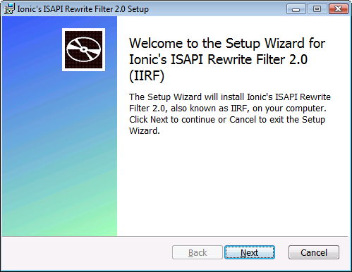

# IIRF - Migrated repo

Last updated 2011

# Ionic's Isapi Rewrite Filter

Ionic's Isapi Rewrite Filter, aka IIRF, is a small, FREE, easy to use, URL rewriting ISAPI filter. It combines a good price (free!) with good features. It is fast and powerful. It works on IIS 6.0, and later. If you use IIS, you can download IIRF and get started right now.

## IIRF is DonationWare

IIRF is so terrific, and so well supported, I know you will want to donate. IIRF is still free, no-charge, and open-source, but I know you will want to donate, I'm accepting donations on behalf of my favorite charity.

## Includes an installer

## Community

IIRF is being actively maintained based on Community input, and the project is open to contributors. If you would like to contribute requirements - please use the Issue Tracker. If you have questions, use the Discussion forums.

## Frequently Asked Questions (FAQ)

### What is URL Rewriting?
That's a big topic, so I'll direct you elsewhere for the answer. Wikipedia has a good entry on the subject.
This is a really good overview, geared toward Apache mod_rewrite, but the concepts apply to all rewriters.

### What is URL Rewriting good for?
Lots of things. Some people use IIRF to allow his community site to expose Search-Engine-Friendly URLs. One person used IIRF to get SharePoint Search to work properly with HTTPS URLs. There are lots of uses. If you use IIS, you can use IIRF to map between the URL the browser enters, and the URL the server "sees". 

### Why was IIRF created?
Apache has mod_rewrite, which allows URL rewriting. But IIS, prior to v7, doesn't have anything similar as a built-in, or as a "standard" free add-on. 

ASP.NET has a URL mapping mechanism, but it works only for filetypes that are handled by ASP.NET: aspx, ascx, asmx, and so on. For static files or non-ASP.NET files, (xml, gif, jpg, css), the ASP.NET mapping won't work cleanly. 

IIS, like the Apache HTTP server, has an extension mechanism: it is called the ISAPI filter. There are commercial ISAPI filters that endow IIS with the ability to re-write URLs. But you have to pay. There are free ones, but they generally don't offer regular expression matching, or automatic configuration reloading, or other powerful features. IIRF is a small, cheap, easy to use, URL rewriting ISAPI filter that combines a good price (free!) with good features. 

### What does IIRF Look like? How do I use it?
IIRF is a single DLL. It installs as an ISAPI Filter on your web server. You configure it with a text-based INI file. 

### What is the license for IIRF?
IIRF is released under the Microsoft Permissive License (Ms PL). Click the License tab on the codeplex site to learn more.

### Can IIRF act as a transparent proxy (like Apache's mod_proxy)?
Yes. ProxyPass, ProxyPassReverse, and ProxyPreserveHost are supported. 

### Does IIRF support regular expressions for the pattern matching?
Yes. a Perl-compatible regular expression syntax is supported, with negative and positive look-aheads, look-behinds, conditionals, and so on. 

### Outstanding! Where does the regular expression support come from?
It comes from the open-source PCRE library. 

### Ok, wait, what's a regular expression?
Again I will defer to Wikipedia on that topic. Regular Expressions define a language for specifying text patterns. It can be challenging to use Regular Expressions if you're not a geek. Be careful, do your homework. 

### Does IIRF use .htaccess syntax? Can I just move over my .htaccess files?
Yes. mostly. Check the IIRF documentation for notable exceptions.

### Ok, What versions of Windows and IIS does IIRF work with?
Windows Server 2003 (including R2) with IIS6, Windows Vista SP1 or later with IIS7, and Windows Server 2008 with IIS7, and on Windows 7.

### But seriously, Why do we need IIRF? There are already free rewriting filters.
There various other rewrite filters for IIS. Each of them has advantages and disadvantages. IIRF is another option. Some of the advantages of IIRF: IIRF is free and open source. IIRF supports regular expressions, for power in rewriting. IIRF does auto-reloading of the rules files. The other options in rewriting filters don't have this combination of capabilities. At the same time, IIRF has limitations. For one thing, it lacks a commercial support mechanism. So... it's your choice.

### Does using IIRF require that I install the .NET Framework on the server in order to use it? 
No. I think the .NET Framework is cool, but IIRF does not depend on the .NET Framework.

### Does IIRF require .NET on my workstation in order to build it?
No. IIRF does not depend on the .NET Framework.

### Why doesn't IIRF use the Regular Expression library in the .NET Framework?
IIRF is built in C, and is designed to be small, native, and fast. IIRF is not built in managed code, hence we cannot rely on the .NET Framework for anything, including regular expressions. 

### Why wouldn't you use .NET managed code for a rewriting filter?
Because in IIS5 and IIS6, ISAPI filters are written in unmanaged code. There's no programming model for managed code ISAPI filters. This is different in IIS7, but still, some people don't want to install or run .NET applications on their web servers. 

### What do I have to install on my server in order to use* IIRF?*
Of course Windows is a pre-requisite: Windows Server 2003 or 2008, Windows XP or Vista. Also you'll need IIS itself. And then the IIRF ISAPI dll. 

### Where can I find the documentation for IIRF?
There's a CHM file that provides all the doc. It describes the features and how to use them. You can also view the helpfile online

### I cannot view the CHM documentation. The error is: "This program cannot display the webpage." or, "The address is invalid." or, "Navigation to the webpage was canceled" Is there an error with the chm file?
No, there is no problem with the CHM file. You have likely encountered a problem with Windows protection of files downloaded from less trusted locations. To view the chm file, within Windows Explorer, right-click on the CHM file, select properties, and Unblock it (button in lower part of properties window).

### If I want to download the source and compile my own version of IIRF, must I install and use Visual Studio on my developer workstation? 
No. IIRF ships with a Visual Studio .sln file, and you CAN use Visual Studio to build it. You can also use the nmake.exe tool to build IIRF, from the command line. To run the make, you need the Windows SDK, and the Microsoft C/C++ compiler, version 8, 9, or 10. You can get that compiler from an installation of Visual Studio, including the (free, no charge) Visual Studio C++ Express edition.

### Must I install Visual Studio if I want to contribute to IIRF, or build the source code?
No. There is a makefile that you can use to build IIRF. It builds with the compiler included in the (free, no-charge) Visual Studio C++ Express edition. If you want to debug the resulting filter, then you may want the full Visual Studio tool.

### How big is the source distribution for IIRF?
IIRF source distribution includes only a small set of source code files.

### Is IIRF available for Windows x64?
Yes, there's a build for x64, available since June 2010.

### Can I use IIRF with PHP urls?
Yes. and CGI, and ASP, and ASP.NET, Joomla, and Mambo, and Ruby, and JSP, and ColdFusion, and a zillion other IIS plugins.
See the RORIIS project for an example of a Ruby-on-Rails framework for IIS that uses IIRF.

### Can I use IIRF to prevent people from directly linking to the image files on my site?
Yes, and you can prevent SQL injection hacks, and you can do lots of other things. Check the readme or the chm doc for more information.
